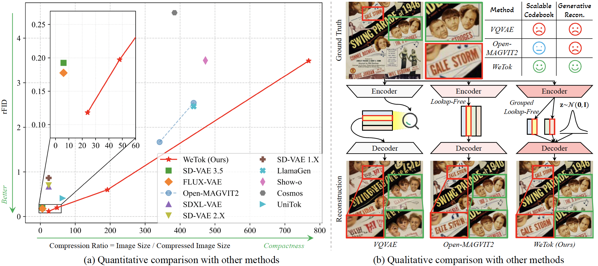

<div align="center">
<h1>🚀 WeTok: Powerful Discrete Tokenization for High-Fidelity Visual Reconstruction</h1>

</div>

This project introduces **WeTok**, a powerful discrete visual tokenizer designed to resolve the long-standing conflict between compression efficiency and reconstruction fidelity. WeTok achieves state-of-the-art reconstruction quality, surpassing previous leading discrete and continuous tokenizers. <br><br>

> <a href="https://github.com/zhuangshaobin/WeTok">WeTok: Powerful Discrete Tokenization for High-Fidelity Visual Reconstruction</a><br>
> [Shaobin Zhuang](https://scholar.google.com/citations?user=PGaDirMAAAAJ&hl=zh-CN&oi=ao), [Yiwei Guo](https://scholar.google.com/citations?user=HCAyeJIAAAAJ&hl=zh-CN&oi=ao), Canmiao Fu, Zhipeng Huang, [Zeyue Tian](https://scholar.google.com/citations?user=dghq4MQAAAAJ&hl=zh-CN&oi=ao), [Ying Zhang](https://scholar.google.com/citations?user=R_psgxkAAAAJ&hl=zh-CN&oi=ao), Chen Li, [Yali Wang](https://scholar.google.com/citations?hl=zh-CN&user=hD948dkAAAAJ)<br>
> Shanghai Jiao Tong University, WeChat Vision (Tencent Inc.), Shenzhen Institutes of Advanced Technology (Chinese Academy of Sciences), Hong Kong University of Science and Technology, Shanghai AI Laboratory<br>
> <a href="./docs/WeTok.md">📚WeTok.md</a>
> ```
> @article{zhuang2026wetok,
>   title={WeTok: Powerful Discrete Tokenization for High-Fidelity Visual Reconstruction},
>   author={Zhuang, Shaobin and Guo, Yiwei and Fu, Canmiao and Huang, Zhipeng and Tian, Zeyue and Zhang, Ying and Li, Chen and Wang, Yali},
>   journal={arXiv preprint arXiv:2409.04410},
>   year={2025}
> }
> ```

<p align="center">
  
  <br>
  <em>WeTok achieves a new state-of-the-art in reconstruction fidelity, surpassing both discrete and continuous tokenizers, while offering high compression ratios.</em>
</p>

## 📰 News
* **[2025.08.05]**:fire::fire::fire: We release WeTok tokenizers trained on a 400M general-domain dataset, achieving a record-low zero-shot rFID of **0.12** on ImageNet, surpassing top continuous tokenizers like FLUX-VAE and SD-VAE 3.5.
* **[2025.08.05]** We are excited to release **WeTok**, a powerful discrete tokenizer featuring our novel **Grouped Lookup-Free Quantization (GFQ)** and a **generative decoder**. Code and pretrained models are now available!

## 📖 Implementations

### 🛠️ Installation
- **Env**: We have tested on `Python 3.9+`, `PyTorch 2.0+` and `CUDA 11.8+` (other versions may also be fine).
- **Dependencies**: `bash env.sh`

### Datasets

- **Image Dataset (e.g., ImageNet)**

We use ImageNet-1K for in-distribution training and evaluation. The dataset should be organized as follows:
```
imagenet
└── train/
    ├── n01440764
        ├── n01440764_10026.JPEG
        ├── ...
    ├── n01443537
    └── ...
└── val/
    ├── ...
```

- **General-Domain Dataset**

For large-scale pre-training, we recommend organizing the data in the WebDataset `tar` format for efficient loading.
```
general_domain_data
└── dataset_1/
    ├── webdataset
        ├── 00000.tar
        ├── 00001.tar
        └── ...
└── dataset_2/
    ├── webdataset
        ├── 00000.tar
        ├── 00001.tar
        └── ...
```

### ⚡ Training & Evaluation
The detailed scripts for training and evaluation can be found in <a href="docs/WeTok.md">WeTok.md</a>.

## ❤️ Acknowledgement
Our work builds upon the foundations laid by many excellent projects in the field. We would like to thank the authors of [Open-MAGVIT2](https://arxiv.org/abs/2409.04410). We also drew inspiration from the methodologies presented in [LFQ](https://arxiv.org/abs/2310.05737), [BSQ](https://arxiv.org/abs/2406.07548). We are grateful for their contributions to the community.